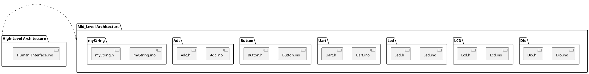
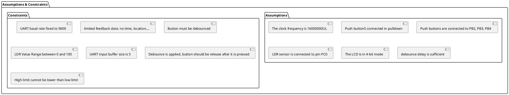
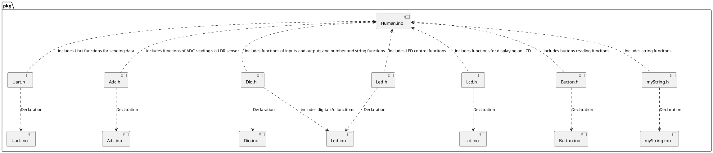

# Detailed Design Document

| **Author**              | `Nour Eldin, Tarek Mahmoud Younes, Kareem Magdy`     |
|:------------------------|:-----------------------------------------------------|
| **Status**              | `Draft`                                              |
| **Version**             | `1.0.0`                                              |
| **Date**                | `16/11/2025`                                         |

## Introduction

This document explains the low-level design for the Light Monitoring and Control Module (LMC), an embedded system component for a small Human-Machine Interface (HMI) project. The LMC is responsible for reading ambient light via a Light-Dependent Resistor (LDR) sensor, processing this reading through the Analog-to-Digital Converter (ADC) on an Arduino Uno, and comparing the value against user-defined high and low limits. The system provides local feedback by sending data using UART to an LCD and interfaces with a Python/Computer Vision application for setting parameters via hand gestures. These parameters include high limit, low limit, and led brightness. The system is merged with another led as an alarm that if the LDR value if out of the limits range, it will turn on.

### Purpose
The purpose of this detailed document is to define the implementation strategy, internal architecture, and public interfaces for the LMC firmware module. This definition is important for guiding the development process, ensuring accurate sensor data acquisition, reliable control logic for limit setting and LED brightness, and facilitating the integration with the external computer vision application and the local LCD display.

### Scope
This document exclusively scopes the Software Design of the LMC firmware. It provides detailed specifications for the logic, data structures, and implementation of the following internal components:

1/ADC Driver Logic: Handling the setup and reading of the LDR sensor data.

2/Input/Output Handling: Debouncing logic for the three push buttons and the PWM control for the LED brightness.

3/Core Decision Logic: The comparison mechanism that determines the system status ("accept" or "danger").

4/UART Communication Protocol: The specific framing, parsing, and transmission logic required for receiving commands (from the Python script/Computer Vision app) and sending data (to the UART-connected LCD).

## Architectural Overview

### Assumptions & Constraints

## Functional Description
The following sections describe software functionality covering all sides of informaiton

### Inputs/Outputs
1/High Limit Push Button: connected to PB2 (input) using a pull down resistor.  
2/Low Limit Push Button: connected to PB3 (input) using a pull down resistor.  
3/Led Control Push Button: connected to PB4 (input) using a pull down resistor.  
4/Alarm Led: connected to PB5 (output)  
5/Brightness LED: connected to PD3 (Output)  
6/LCD Pins: (D4:D7) connected to (PD4:PD7) and Enable is connected to PB1 and RS is connected to PB0. (Output)  
7/LDR sensor: Connected to PC0 (input) via ADC.  

### Functionlity
1/ The LDR sensor continuously reads the light value and sends it to LCD   
2/ If the value is in the range between (lower than or equal to the high limit and higher than or equal to the low limit), it will send a message "Accept" to the LCD confirming that the vlaue is accepted, alarm led is off. Other wise, it will send the value "Danger" refering that the value is not in range, alarm led is on.  
3/ If any of the buttons is pressed, its value (High limit, Low Limit, Led Brightness) is changed according to the hand gesture application using the laptop camera. The button should be pressed again to confirm the last application value  
4/ If the Led Brightness value is the one that is changed, the value is reflected on led brightness.  

## Implementation of the Module
After Hardware Communication:

#### Software

###### A. Initialization Routines (Startup)  
These steps are executed once upon system power-on or reset to configure the MCU peripherals and external components:  
1/ UART Initialization: Configures the serial interface for communication with both the PC (for control/testing) and the UART-connected LCD. 
 
    1.1- Set baud rate to 9600.  
    1.2- Enable the hardware transmitter and receiver.  

2/ LCD Initialization: Sets up the output communication for the display module.  

    2.1- Set the LCD Port Direction as output.  
    2.2- Apply a 20 ms power-on delay before sending commands.  
    2.3- Send the necessary commands for 4-bit initialization (4-bit mode).  
    2.4- Configure the display: display is ON, cursor is OFF, cursor is incremented, and the screen is cleared.  

3/ ADC Initialization: Configures the Analog-to-Digital Converter for LDR reading.  

    3.1- Set the reference voltage to AVcc pin.  
    3.2- Apply a prescaler of 128 to the ADC clock source.  

4/ Initial Display Setup: Transmit the required text strings to the LCD.Send the variable names (e.g., "HL," "LL," "LDR:") to the LCD for  
    persistent display.  
5/ Setting LED Pin as output.  

###### B. Main Loop Logic (Continuous Operation)
This loop runs indefinitely after initialization, handling core functionality:  
5/ ADC Reading and Display:  

    5.1- Execute the ADC conversion sequence to read the sensor value.  
    5.2- The raw sensor value is converted to the final digital value and displayed on the LCD in its dedicated area.  

6/ Limit Check and Status Output:  

    6.1- Compare the current LDR reading against the established High Limit (HL) and Low Limit (LL) values.  
    6.2- If the LDR value is within the range [LL, HL], the status "Accept" is displayed on the LCD and alarm led is set off.
    6.3- If the LDR value is out of range (below LL or above HL), the status "Danger" is displayed on the LCD and alarm led is set on.

7/ Limits and LED Control (Input Handling):  

    7.1- Monitor the three control push buttons.  
    7.2- If any button is pressed, the system transitions to the hand gesture control mode:   
        7.2.1- The system signals the host PC via UART to receive the new value determined by the hand gestures.  
        7.2.2- The new value is received by the Arduino via UART, validated, and applied.  
        7.2.3- This new value is then immediately transmitted via UART to the LCD for display.  
        Note: The new value is confirmed by pressing again on the same button.  

### Notes
1/ Any port pin is set by default by 0 (input)  
2/ The limits and LED brightness change can be changed by sending data using UART from the serial monitor on arduino.  
3/ If a button is pressed for long time, the hand gesture application will not start until the button is unpressed. 
4/ The hand gestures application works with laptop camera and can't be applied using Arduino IDE.  
5/ LCD can be used in 8-bit mode but it is better to use it in 4 bit mode.    
6/ Custom characters values are found in LCD Custom Character Generators.

### Static Files
The UCM module consists of the following arduino and header files:

| File name     | Contents                                                                     |
|---------------|------------------------------------------------------------------------------|
| Uart.ino      | UART used-defined functions                                                  |
| Uart.h        | The header file of the UART functions that includes declarations             |
| Dio.ino       | Input and output functions                   |
| Dio.h         | The declaration file of digital input output funcitons |
| Adc.ino       | The functions of Ananlog to Digital Conversion |
| Adc.h         | The declaration ADC functions |
| Lcd.ino         | The functions of LCD |
| Lcd.h         | The declaration file of LCD functions |
| Led.ino       | LED control functions |
| Led.h         | The declaration file LED functions |
| Button.ino         | Button control functions |
| Button.h         | The declaration file of button functions |
|myString.ino|  Custom string manipulation functions|
|myString.h| The declaration file of custom string funcitons
| Human.ino | Integrating all codes in one file according to the system function           |

### Include Structure

### Configuration
The following parameters must be define according to the user case and situation.
| Name             |Value range     | Description                                                             |
|------------------|----------------|-------------------------------------------------------------------------|
|F_CPU             |16000000UL      |The frequency of the MCU used for baud rate calculation                  |
|BaudRate          |   9600         |The fixed baud rate for serial UART communication                        |
|PWM LED Pin       | DDD3/PD3 (0C2B)|The pin used for the controllable LED brightness (using Timer 2 PWM).    |
|Alarm LED Pin     |     PB5        |The pin used for the Status/Alarm LED (ON/OFF).                          |
|Low Limit Button  |     PB2        |The pin for the Low Limit selection button.                              |
|High Limit Button |     PB3        |The pin for the High Limit selection button.                             |
|LED Control Button|    PB4         |The pin for the LED Brightness control selection button.                 |
| LDR ADC Channel  | PC0            |   The Analog Channel used to read the LDR sensor.                       |
|Main Loop Delay   | 10 ms          | The small delay at the end of the main while(1) loop iteration.         |

